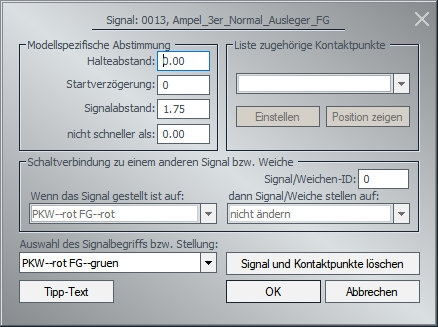
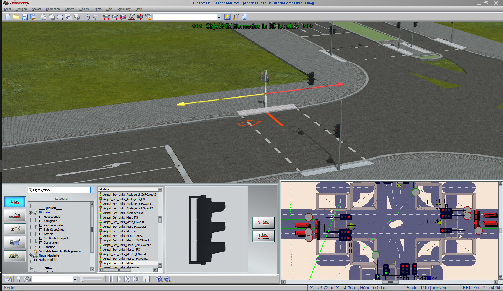

# Ampeln aufstellen

## "Alte Ampeln" im 1-spurigen System benutzen

Ampeln, die für das alte System entworfen wurden, kannst Du auch im neuen System verwenden.

Klicke im Einfügemodus von EEP rechts auf die Ampel und wähle "Objekteigenschaften".

Die Ampeln haben normalerweise einen _Signalabstand_ von 3 Metern. Ändere diesen Abstand von `1.75` Meter und schaue Dir das Ergebnis an.

## Nur eine Ampel auf der Fahrbahn

Um Probleme durch hintereinander aufgestellte Ampeln zu vermeiden, stelle **nur eine Ampel** auf die Fahrbahn, auf der die Fahrzeuge anhalten sollen.

**Stelle alle anderen Ampeln auf die Gegenfahrbahn** und ändere ihren Seitenabstand, so dass sie passend zu Deiner Spur stehen.

* Die Ampel in der Mitte oben beeinflusst den Verkehr auf der "richtigen" Fahrspur.

    

* Die Ampel links zeigt zwar das selbe Signalbild, wie die in der Mitte auf der "richtigen" Fahrspur, steht aber auf der Gegenfahrbahn. Das hat den Vorteil, dass sie den Verkehr der "richtigen" Fahrspur nicht beeinflusst. Sie beeinflusst auch nicht den Verkehr der Gegenfahrbahn, da dieser in die andere Richtung unterwegs ist.

    

## Wenn Fußgängerampeln Autos anhalten

Einige Fußgängerampeln stoppen Autos, wenn sie grün sind. Wenn Dich das beim Abbiegen stört, dann setze auch diese Ampeln auf die Gegenfahrbahn und positioniere sie mit dem Signalabstand. 
