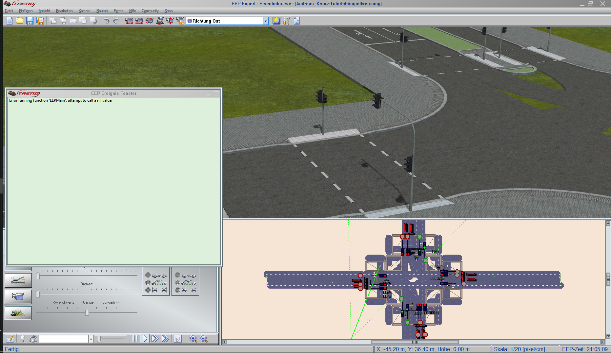
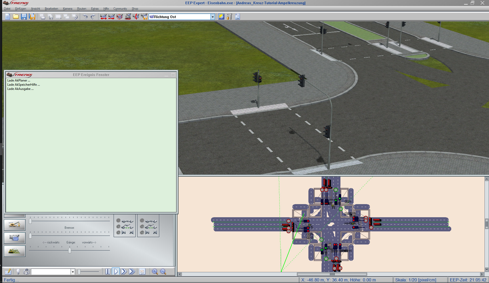
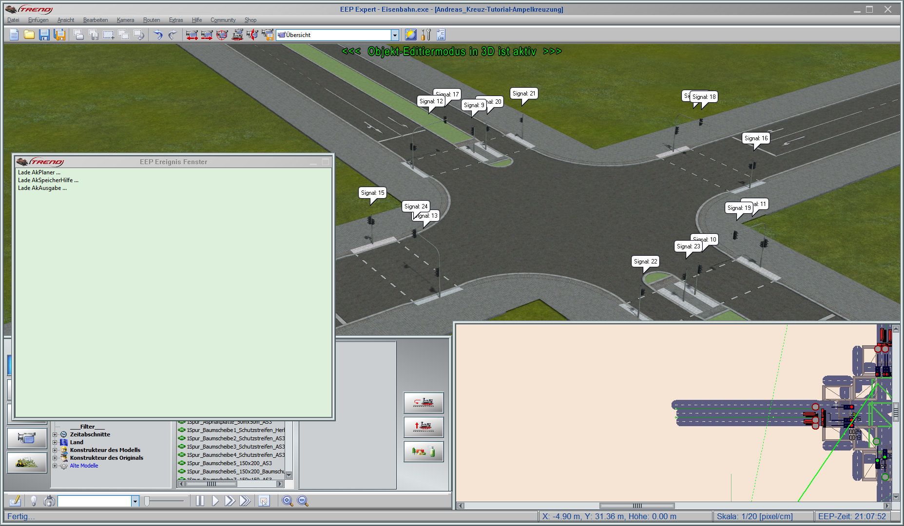
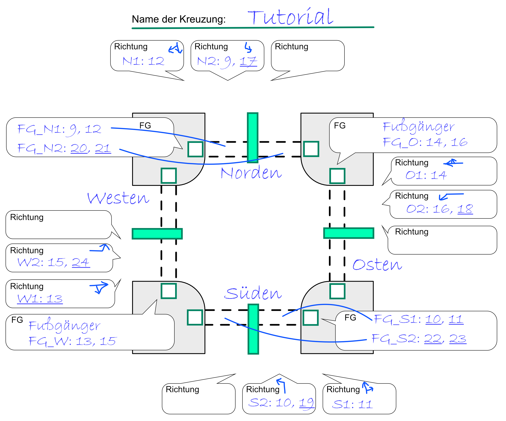
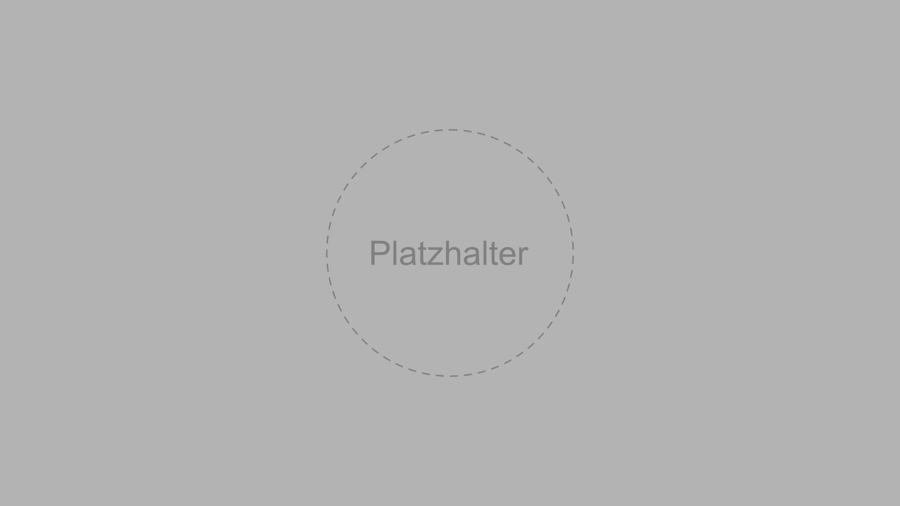

# Ampelkreuzung automatisch steuern


## Inhalt
<!-- TOC depthFrom:2 depthTo:6 withLinks:1 updateOnSave:1 orderedList:0 -->

- [Inhalt](#inhalt)
- [Was Du lernst](#was-du-lernst)
- [Was Du brauchst](#was-du-brauchst)
- [Checkliste](#checkliste)
- [Los geht's](#los-gehts)
	- [Das Lua-Hauptskript anlegen](#das-lua-hauptskript-anlegen)
	- [Notwendige Befehle in das Lua-Skript aufnehmen](#notwendige-befehle-in-das-lua-skript-aufnehmen)
	- [Alle Signale mit Info-Blasen markieren](#alle-signale-mit-info-blasen-markieren)
	- [Die Richtungen und Signal-IDs der Kreuzung notieren](#die-richtungen-und-signal-ids-der-kreuzung-notieren)
	- [Schreibe die Richtungen in das Haupt-Skript](#schreibe-die-richtungen-in-das-haupt-skript)
	- [Fasse die Richtungen nun zu Schaltungen zusammen](#fasse-die-richtungen-nun-zu-schaltungen-zusammen)
- [Herzlichen Glückwunsch!](#herzlichen-glückwunsch)

<!-- /TOC -->
## Was Du lernst

* Diese Anleitung zeigt Dir, wie Du in EEP eine mit Ampeln versehene Kreuzung mit dem Skript verdrahten kannst.

## Was Du brauchst

* **EEP 14** - das Programm - _[Download](https://www.eepshopping.de)_

* **Ak-Lua-Skripte-für-EEP** - Eine Sammlung verschiedener Lua Skripte für EEP

  So kannst Du die Skripte installieren - [Installation von "Ak-Lua-Skripte-für-EEP"](Installation.md)

* **Einen Editor für Lua-Skripte** - ein Editor Deiner Wahl, z.B. Notepad++

* **Zettel und Stift** - _[Download Kreuzungsaufbau.pdf](../assets/Kreuzungsaufbau.pdf)_

* **Eine Anlage mit fertigen Kreuzungen und vorinstallierten Ampeln**

  Extra für diese Anleitung wurde eine Anlage erstellt:  _[Andreas_Kreuz_Anleitung_Ampel](https://github.com/Andreas-Kreuz/ak-lua-skripte-fuer-eep)_. Wenn Du diese Anlage verwenden möchtest, brauchst Du folgende Modelle:

  * 1Spur-Großstadtstraßen-System-Grundset (V10NAS30002) - _[Download](https://eepshopping.de/1spur-gro%C3%83%C6%92%C3%82%C5%B8stadtstra%C3%83%C6%92%C3%82%C5%B8en-system-grundset%7C7656.html)_
  * 1Spur-Ergänzungsset - _[Download](https://www.eepforum.de/filebase/file/215-freeset-zu-meinem-1spur-strassensystem/)_
  * Ampel-Baukasten für mehrspurige Straßenkreuzungen (V80NJS20039) - _[Download](https://eepshopping.de/ampel-baukasten-f%C3%83%C6%92%C3%82%C2%BCr-mehrspurige-stra%C3%83%C6%92%C3%82%C5%B8enkreuzungen%7C6624.html)_
  * Straßenbahnsignale als Immobilien (V80MA1F010 und V10MA1F011) -  _[Download](https://eepshopping.de/ampel-baukasten-f%C3%83%C6%92%C3%82%C2%BCr-mehrspurige-stra%C3%83%C6%92%C3%82%C5%B8enkreuzungen%7C6624.html)_

## Checkliste
* [ ] Skriptsammlung "Ak-Lua-Skripte-für-EEP" ist installiert
* [ ] Du hast eine Anlage mit einer Ampelkreuzung oder "Andreas_Kreuz_Anleitung_Ampel" geöffnet

## Los geht's
* Öffne die Anlage in EEP
* Öffne Deinen Editor

### Das Lua-Hauptskript anlegen
_**Tipp:** Aktiviere in EEP unter Programmeinstellungen das EEP Ereignisfenster, damit Du die Lua Meldungen lesen kannst._

_**Tipp:** Diese Anleitung geht davon aus, dass in der geöffneten Anlage noch nichts mit LUA gemacht wurde. Verwendest Du Dein eigenes Anlagen-Skript, dann lösche es nicht, sondern ergänze es um die weiter unten aufgeführten Befehle._


* Das Editieren der Skripte findet im LUA-Verzeichnis von EEP statt, z.B. in `C:\Trend\EEP14\LUA`

* Öffne den LUA-Editor in EEP, wähle alles mit `<Strg>` + `<A>` aus und ersetze es durch

  ```lua
  clearlog()
  require("meine-ampel-main")
  ```

* Klicke danach in EEP auf Skript neu laden und wechsle in den 3D-Modus.

	**Wenn Du alles richtig gemacht hast**, erscheint im Log eine Fehlermeldung, dass `meine-ampel-main.lua` nicht gefunden werden kann.

    

* Lege nun das Haupt-Skript an `C:\Trend\EEP14\LUA\meine-ampel-main.lua` im Verzeichnis `LUA` an

    Dies wird das Skript werden, welches in der Anlage verwendet wird. Egal, wie Deine Anlage heißt.

* Klicke danach in EEP auf Skript neu laden und wechsle in den 3D-Modus.
    **Wenn Du alles richtig gemacht hast**, erscheint eine Fehlermeldung, dass `meine-ampel-main.lua` nicht gefunden werden kann.

    


### Notwendige Befehle in das Lua-Skript aufnehmen

* Ergänze das Lua-Hauptskript um die folgenden Zeilen.
    ```lua
    require("ak.strasse.AkStrasse")

    -- Hier kommt der Code

    function EEPMain()
        AkKreuzung:planeSchaltungenEin()
        AkPlaner:fuehreGeplanteAktionenAus()
        return 1
    end
    ```

* Klicke danach auf Skript neu laden und wechsle in den 3D-Modus.
**Wenn Du alles richtig gemacht hast**, verschwindet die Fehlermeldung

    

**Was ist grade passiert?**
* Die Zeile `require("ak.strasse.AkStrasse")` sorgt dafür, daß die Datei `ak/strasse/AkStrasse.lua` einmal eingelesen wird. Nach diesem Aufruf stehen Dir alle Funktionen dieser Datei zur Verfügung.
* Die Zeile `AkKreuzung:planeSchaltungenEin()` ist für das Einplanen aller Schaltvorgänge der Kreuzungen notwendig. Diese Vorgänge werden als Aktionen im Planer hinterlegt.
* Die Zeile `AkPlaner:fuehreGeplanteAktionenAus()` ist für das Ausführen aller geplanten Aktionen notwendig.
* Wichtig ist auch, dass die Funktion EEPMain mit `return 1` beendet wird, damit sie alle 200 ms aufgerufen wird.


### Alle Signale mit Info-Blasen markieren
_**Tipp:** Verwende diesen Code nicht, wenn Du Deine Anlagen manuelle Info-Blasen mit `EEPShowSignalInfo(...)` an Deinen Signalen anzeigst. Denn all diese Info-Blasen werden gelöscht._

* Um die Signale (in dem Fall Ampeln) der Kreuzung zu bearbeiten ist es am einfachsten, wenn Du die Signal-IDs aller Signale in Info-Blasen anzeigst. - Füge die Zeile `AkKreuzung.zeigeSignalIdsAllerSignale = true` und danach `AkKreuzung.zeigeSchaltungAlsInfo = true` vor der EEPMain()-Methode hinzu:
    ```lua
    -- Hier kommt der Code
    AkKreuzung.zeigeSignalIdsAllerSignale = true
	AkKreuzung.zeigeSchaltungAlsInfo = true
    ```
* Klicke danach auf Skript neu laden und wechsle in den 3D-Modus.
    **Wenn Du alles richtig gemacht hast**, siehst Du an allen Signalen Info-Blasen mit den IDs dieser Signale.

    

__Was ist grade passiert?__
  * Das neu Laden der Anlage hat dafür gesorgt, dass die Lua-Skripte anhand der Variable alle Signale von 1 bis 1000 mit einer Info-Blase versehen haben.

### Die Richtungen und Signal-IDs der Kreuzung notieren
_**Tipp:** Das PDF-Dokument hilft Dir deine Kreuzung zu notieren._

Notiere Dir, welche _Richtungen_ es gibt und wie die IDs der zu schaltenden Ampeln heißen - merke Dir dabei, welche unterschiedlichen Ampelmodelle eingesetzt werden. In der Beispielanlage sind es:
  * Kombinierte Fußgänger- und Strassenverkehrsampeln
  * Reine Fußgängerampeln _(die sind in der Skizze bei "FG" unterstrichen)_
  * Strassenverkehrsampeln _(die sind in der Skizze bei "Richtung" unterstrichen)_



**Was ist eine _Richtung_**: In diesem Abschnitt wird viel von _Richtungen_ geredet. So eine _Richtung_ fasst mehrere Fahrspuren, die den selben Weg nehmen zusammen und schaltet alle Ampeln, die diesen Weg freigeben.
* **Fasse mehrere Fahrspuren in die den selben Weg nehmen immer zu einer _Richtung_ zusammen** (also mehrere Linksabbieger-, Geradeaus- **oder** Rechtsabbieger-Spuren), denn Spuren in die selbe _Richtung_ werden immer gemeinsam geschaltet.
* **Erstelle immer eigene Fahrspuren und _Richtungen_ für Linksabbieger, denn diese achten nicht auf den Gegenverkehr**. Darum solltest Du den Linksabbieger-Fahrspuren immer eine eigene _Richtung_ geben und diese nur dann auf grün schalten, wenn der Gegenverkehr den Fahrweg der Linksabbieger nicht kreuzen kann.
	* **Alternative:** Du kannst auch mit unsichtbaren Ampeln arbeiten, die bei Gegenverkehr auf rot schalten. Dies musst Du jedoch selbst machen.
* **Du kannst getrennte Rechtsabbieger-Fahrspuren und Geradeaus-Fahrspuren zu einer _Richtung_ zusammenfassen.**
* Spendiere Deinen Fußgängerampeln eigene _Richtungen_, denn diese werden von der Automatik eher auf rot geschaltet.

Erst im nächsten Schritt werden mehrere dieser _Richtungen_ zu Schaltungen zusammengefasst.

### Schreibe die Richtungen in das Haupt-Skript
_**Tipp:** Für jede Ampel musst Du den_ `AkAmpelModell` _kennen, da sich die Signalstellungen in EEP unterscheiden. Weitere Informationen findest Du unter: [Unterstütze weitere Ampeln in AkAmpelModell](../ak/strasse/README.md)_

Schreibe nun die einzelnen Richtungen in das Haupt-Skript. Jede Richtung muss dabei eine noch nicht verwendete Speicher-ID zwischen 1 und 1000 bekommen.

TODO!!!

```lua
-- region K2-Richtungen
----------------------------------------------------------------------------------------------------------------------
-- Definiere alle Richtungen fuer Kreuzung 1
----------------------------------------------------------------------------------------------------------------------

--      +------------------------------------------------------ Neue Richtung
--      |              +--------------------------------------- Name der Richtung
--      |              |             +------------------------- Speicher ID - um die Anzahl der Fahrzeuge
--      |              |             |                                        und die Wartezeit zu speichern
--      |              |             |      +------------------ neue Ampel für diese Richtung (
--      |              |             |      |           +------ Signal-ID dieser Ampel
--      |              |             |      |           |   +-- Modell dieser Ampel - weiss wo rot, gelb und gruen ist
k2_r1 = AkRichtung:neu("Richtung 1", 121, { AkAmpel:neu(32, Grundmodell_Ampel_3) })
k2_r2 = AkRichtung:neu("Richtung 2", 122, { AkAmpel:neu(31, Grundmodell_Ampel_3) })
k2_r3 = AkRichtung:neu("Richtung 3", 123, { AkAmpel:neu(34, Grundmodell_Ampel_3) })
k2_r4 = AkRichtung:neu("Richtung 4", 124, { AkAmpel:neu(33, Grundmodell_Ampel_3) })
k2_r5 = AkRichtung:neu("Richtung 5", 125, { AkAmpel:neu(30, Grundmodell_Ampel_3) })
```

* Klicke danach im LUA-Editor von EEP auf "Skript neu laden" und wechsle in den 3D-Modus.
    **Wenn Du alles richtig gemacht hast**, siehst Du weiterhin an allen Signalen Info-Blasen mit den IDs dieser Signale und keine Fehlermeldung im Log.

__Was ist grade passiert?__
  * Du hast soeben die Richtungen der Kreuzung festgelegt. Jede kann für sich allein geschaltet werden oder zusammen mit anderen Richtungen. Dazu dient `AkKreuzungsSchaltung`, welches im nächsten Schritt zum Einsatz kommt.

### Fasse die Richtungen nun zu Schaltungen zusammen

Notiere Dir, welche der _Richtungen_ zu _Schaltungen_ zusammengefasst werden sollen.

**Beachte**: Eine _Schaltung_ darf nur _Richtungen_ enthalten, die sich nicht gegenseitig überlappen sollte


Im Beispiel siehst Du, dass Richtungen in mehreren Schaltungen enthalten sein können.


### Schreibe die Schaltungen in das Haupt-Skript
TODO!!!

```lua
--------------------------------------------------------------
-- Definiere alle Schaltungen fuer Kreuzung 2
--------------------------------------------------------------
-- Eine Schaltung bestimmt, welche Richtungen gleichzeitig auf
-- grün geschaltet werden dürfen, alle anderen sind rot

--- Kreuzung 2: Schaltung 1
local k2_schaltung1 = AkKreuzungsSchaltung:neu("Schaltung 1")
k2_schaltung1:fuegeRichtungHinzu(k2_r1)
k2_schaltung1:fuegeRichtungHinzu(k2_r2)
k2_schaltung1:fuegeRichtungHinzu(k2_r3)

--- Kreuzung 2: Schaltung 2
local k2_schaltung2 = AkKreuzungsSchaltung:neu("Schaltung 2")
k2_schaltung2:fuegeRichtungHinzu(k2_r1)
k2_schaltung2:fuegeRichtungHinzu(k2_r2)

--- Kreuzung 2: Schaltung 3
local k2_schaltung3 = AkKreuzungsSchaltung:neu("Schaltung 3")
k2_schaltung3:fuegeRichtungHinzu(k2_r3)
k2_schaltung3:fuegeRichtungHinzu(k2_r4)

--- Kreuzung 2: Schaltung 4
local k2_schaltung4 = AkKreuzungsSchaltung:neu("Schaltung 4")
k2_schaltung4:fuegeRichtungHinzu(k2_r5)

k2 = AkKreuzung:neu("Kreuzung 2")
k2:fuegeSchaltungHinzu(k2_schaltung1)
k2:fuegeSchaltungHinzu(k2_schaltung2)
k2:fuegeSchaltungHinzu(k2_schaltung3)
k2:fuegeSchaltungHinzu(k2_schaltung4)
```

* Klicke danach im LUA-Editor von EEP auf "Skript neu laden" und wechsle in den 3D-Modus.
    **Wenn Du alles richtig gemacht hast**, siehst Du plötzlich, dass die Schaltungen zum Leben erwachen.

    

__Was ist grade passiert?__
  * Du hast soeben die Richtungen zu Schaltungen zusammengefasst und einer Kreuzung zugewiesen. Durch die beiden am Anfang hinzugefügten Aufrufe in EEPMain() plant die Kreuzung automatisch ihre Schaltungen der Planer führt sie aus.

## Herzlichen Glückwunsch!
Du hast diese Anleitung abgeschlossen.

So kannst Du weitermachen:
* Füge die noch fehlenden Richtungen und Schaltungen hinzu

Themen für Fortgeschrittene
* Füge Kontaktpunkte und Zähler hinzu
* Füge Richtungen hinzu, die nur auf Anforderung geschaltet werden
