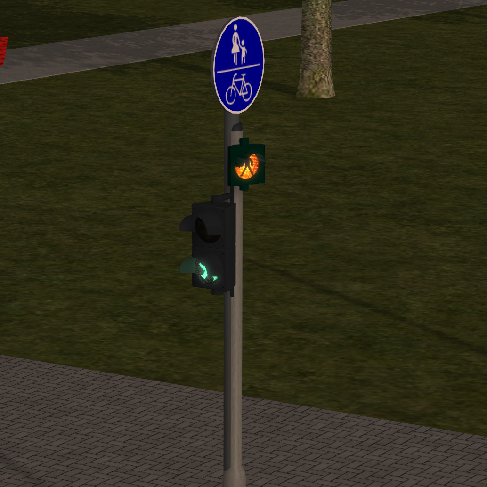

# Änderungen an der Software

# v0.4.1

Neue Funktionen:

* Generelle Unterstützung für Ampeln mit Immobilien sowie Licht-Funktionen.
  Dafür gibt es folgende neue Funktionen in AkAmpel:

* Unterstützung für die Lichtsteuerung mehrerer Immobilien je Ampel:

  ```lua
  --- Schaltet das Licht der angegebenen Immobilien beim Schalten der Ampel auf rot, gelb, grün oder Anforderung
  -- @param rotImmo Name der Immobilie, deren Licht eingeschaltet wird, wenn die Ampel rot oder rot-gelb ist
  -- @param gruenImmo Name der Immobilie,  deren Licht eingeschaltet wird, wenn die Ampel grün ist
  -- @param gelbImmo Name der Immobilie,  deren Licht eingeschaltet wird, wenn die Ampel gelb oder rot-gelb ist
  -- @param anforderungImmo Name der Immobilie,  deren Licht eingeschaltet wird, wenn die Ampel eine Anforderung erkennt
  --
  function AkAmpel:fuegeLichtImmoHinzu(rotImmo, gruenImmo, gelbImmo, anforderungImmo) end
  ```

* Unterstützung für die Achssteuerung mehrere Immobilien je Ampel:

  ```lua
  --- Ändert die Achsstellung der angegebenen Immobilien beim Schalten der Ampel auf rot, gelb, grün oder Fußgänger
  -- @param immoName Name der Immobilie, deren Achse gesteuert werden soll
  -- @param achsName Name der Achse in der Immobilie, die gesteuert werden soll
  -- @param grundStellung Grundstellung der Achse (wird eingestellt, wenn eine Stellung nicht angegeben wurde
  -- @param stellungRot Achsstellung bei rot
  -- @param stellungGruen Achsstellung bei grün
  -- @param stellungGelb Achsstellung bei gelb
  -- @param stellungFG Achsstellung bei FG
  --
  function AkAmpel:fuegeAchsenImmoHinzu(immoName, achsName, grundStellung,
  stellungRot, stellungGruen, stellungGelb, stellungFG) end
  ```

  Hier ein Beispiel für die Verwendung:

  ```lua
  local a1 = AkAmpel:neu(101, AkAmpelModell.JS2_2er_nur_FG)
  a1:fuegeAchsenImmoHinzu("#5816_Warnblink Fußgänger rechts", "Blinklicht", 0, nil, nil, nil, 50)
  local a2 = AkAmpel:neu(102, AkAmpelModell.JS2_2er_nur_FG)
  a2:fuegeAchsenImmoHinzu("#5815_Warnblink Fußgänger links", "Blinklicht", 0, nil, nil, nil, 50)
  ```


* Die Achssteuerung unterstützt z.B. Modelle von Kju

  * Warnblinklichter http://www.eep.euma.de/downloads/V80MA1F016.zip
    


# v0.4.0
* Das Projekt heißt nun **[Lua-Bibliothek für EEP](https://andreas-kreuz.github.io/ak-lua-bibliothek-fuer-eep/)**

## Neue Funktionen
* Erkennen von Verkehr an roten Signalen
  `richtung:zaehleAnSignalAlle(xx)`
  `richtung:zaehleAnSignalBeiRoute(xx)`

* Erkennen von Verkehr auf Straßen
  `richtung:zaehleAnStrasseAlle(xx)`
  `richtung:zaehleAnStrasseBeiRoute(xx)`

## Änderungen
* Komplett neue Webseite
* Verbesserter Tooltip für die Ampeln bei Anzeige der Debug-Informationen
* Die Dokumentation liegt nun nicht mehr als PDF in der Anlage


# vorherige Versionen

* Aufbau einer API

