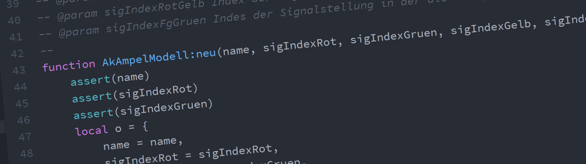

# Lua-Skript Dokumentation

## Skripte in `ak`
* __[ak/eep](eep/)__ EEP-eigene Funktionen für Testskripte
* __[ak/schiene](schiene/)__ Steuerung für die Eisenbahn (IN ARBEIT)
* __[ak/modellpacker](modellpacker/)__ - Erzeugt Installationsdateien
* __[ak/planer](planer/)__ - Aufgabenplaner für EEP
* __[ak/speicher](speicher/)__ - Speichern und Laden von String-Tabellen
* __[ak/strasse](strasse/)__ - Steuerung für den Straßenverkehr
