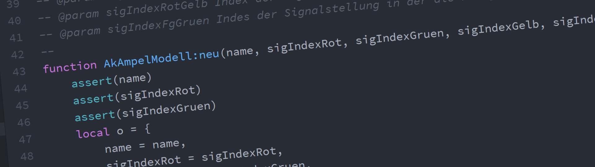

# Lua-Skripte für EEP 14

Allgemeine Lua-Skripte zur Verkehrssteuerung in EEP.

## Anstehende Aufgaben bevor dieses Projekt aktiv wird

* __Die [Vorbereitungen für dieses Projekt](https://github.com/Andreas-Kreuz/ak-lua-skripte-fuer-eep/projects/2)
sind noch im vollen Gange.__

* Der Download der Skripte und Anlagen wird über das [EEP-Forum](https://www.eep-forum.de) erfolgen.

## Loslegen

Die bereitgestellten Funktionen sollen die _Steuerung des Verkehrs vereinfachen_, damit Du Dich als Anlagen-Ersteller auf andere Aspekte konzentrieren kann.
Natürlich musst Du trotzdem ein wenig Hand anlegen.

* Mit __[Beispiel-Anlagen](Resourcen/Anlagen/)__ kannst Du einen guten Eindruck der Funktionalität bekommen.

* Die __[Lua-Skript Dokumentation](LUA/ak/)__ hilft Dir bei der Verwendung der Funktionen. (Schau doch mal bei [ak.strasse](LUA/ak/strasse) nach)

* Du willst die __[Skripte direkt aus GitHub verwenden](doc/GITHUB_NUTZEN.md)__?

__Bitte beachte__: Verwende nur Funktionen, die in der LUA-Dokumentation zur Benutzung freigegebenen sind. Andere Funktionen können jederzeit geändert werden.

## Beiträge sind Willkommen
__Bitte beachte__: Bevor die oben beschriebenen anstehenden Aufgaben abgearbeitet sind und das Projekt noch nicht aktiv ist, könnte Deine Arbeit umsonst gewesen sein, da noch sehr viel umgebaut wird.

* [So kannst Du zum Projekt beitragen](doc/CONTRIBUTING.md)

## Was ist EEP?

EEP (Eisenbahn.exe Professional) ist eine [Simulationssoftware des Trendverlags](https://trendverlag.com/was-ist-eep-eisenbahn-exe.html). Seit Version 11 wird eine Integration von Lua angeboten.
