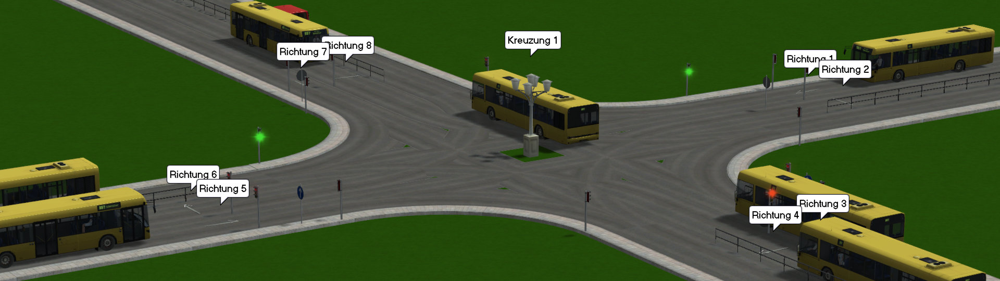
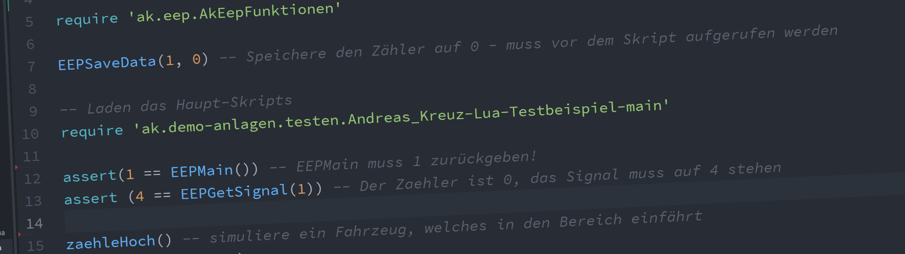

## Beispielanlagen in `ak-demo-anlagen` deren Skripte in `ak-demo-lua`

# Demo Anlage Ampel

* __[Andreas_Kreuz-Demo-Ampel](Andreas_Kreuz-Demo-Ampel/)__

    __Demonstration zweier Ampelschaltungen__ - Diese Anlage zeigt die Grundlagen anhand zweier Kreuzungen (nur mit Grundmodellen aus EEP 14)

----

# Demo Anlage Testen

* __[Andreas_Kreuz-Demo-Testen](Andreas_Kreuz-Demo-Testen/)__

    __Demonstration eines ausführlichen Test-Skriptes__ - Der Aufbau der Skripte dieser Anlage zeigt, wie man Lua-Skripte testen kann, ohne EEP zu starten, siehe [ak-demo-lua/testen](ak-demo-lua/testen/)
