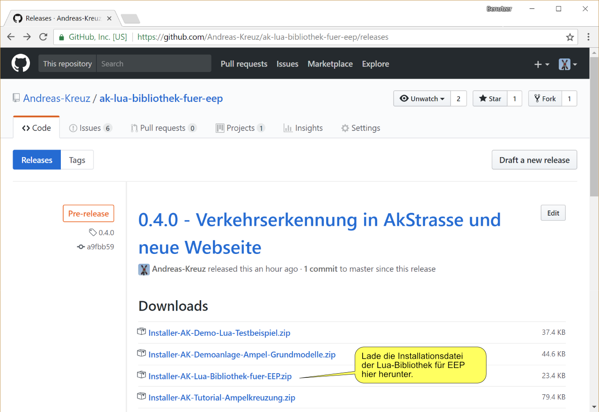

# Installation von Ak-Lua-Skripte-für-EEP

## Herunterladen
* Lade Dir die Datei `Installer-AK-Skriptsammlung.zip` herunter: _[Releases von Ak-Lua-Skripte-für-EEP](https://github.com/Andreas-Kreuz/ak-lua-skripte-fuer-eep/releases)_

    

## Installieren
Öffne EEP und verwende den Modell-Installer, um die Skripte zu installieren
* Klicke auf Modell-Installer

    

* Wähle die heruntergeladene Datei aus

    

* Starte die Installation

    

__Tipp:__ Das Scannen nach neuen Modellen ist nicht notwendig, da die Skripte keine 3D-Modelle enthalten.

## Glückwunsch!
Du hast die Installation abgeschlossen.  :four_leaf_clover:

Die Skripte wurden in das  Unterverzeichnis `LUA/ak` Deiner EEP-Installation installiert, z.B. in `C:\Trend\EEP14\LUA\`.

Jetzt kannst Du die [Anleitung für eine automatische Ampelkreuzung](Ampelkreuzung.md) starten oder die [Lua-Skript Dokumentation](../LUA/ak/README.md) lesen.
