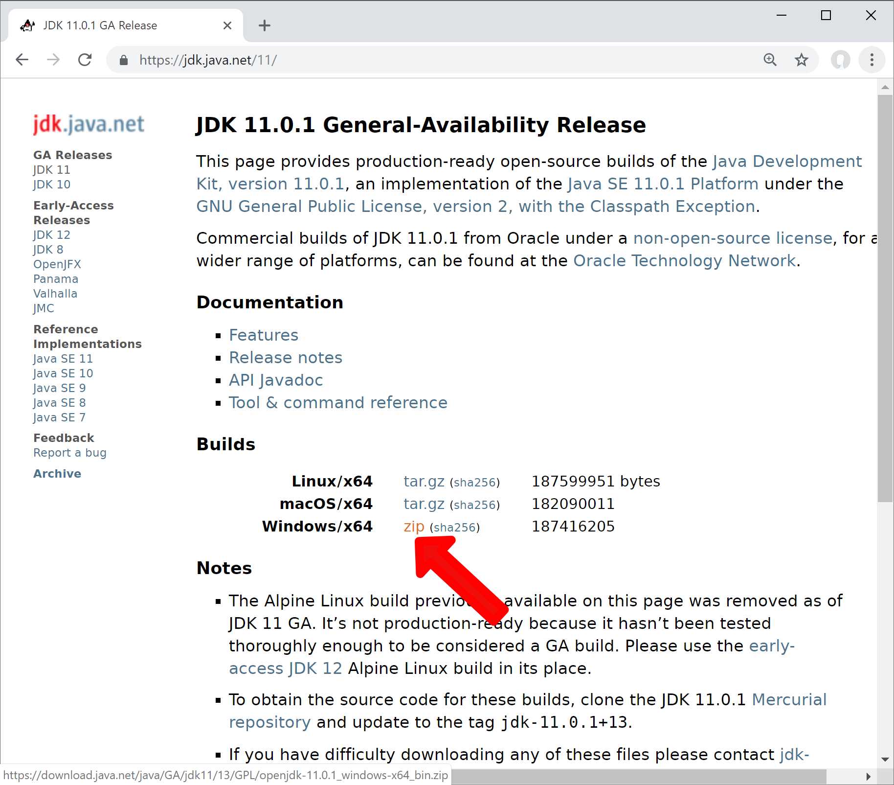
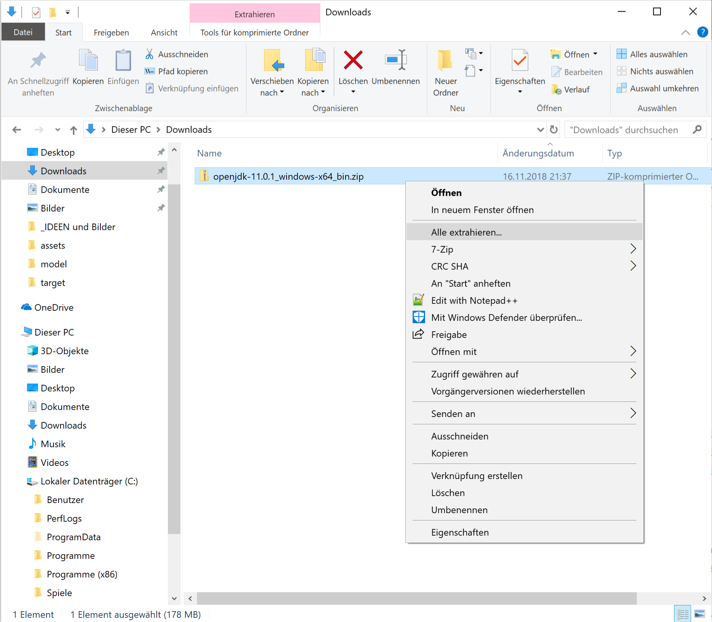
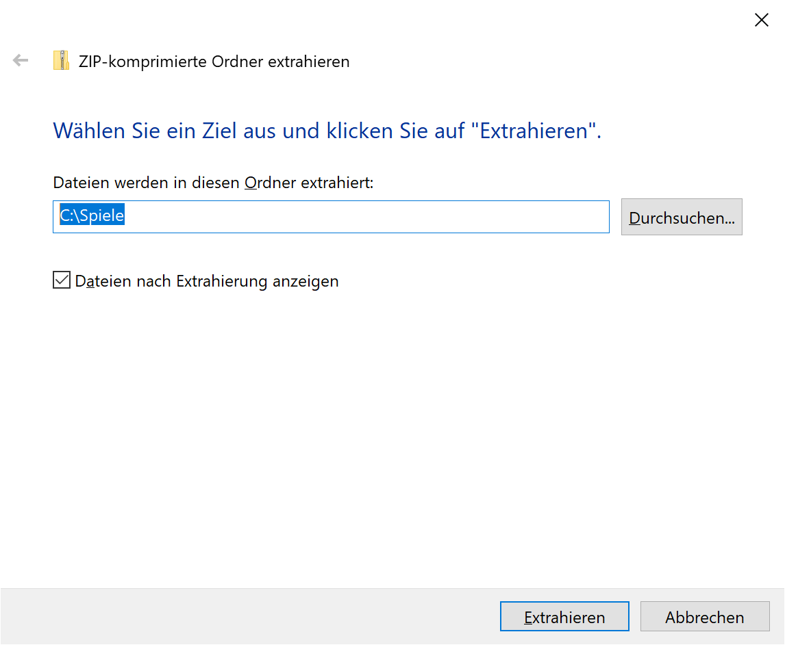
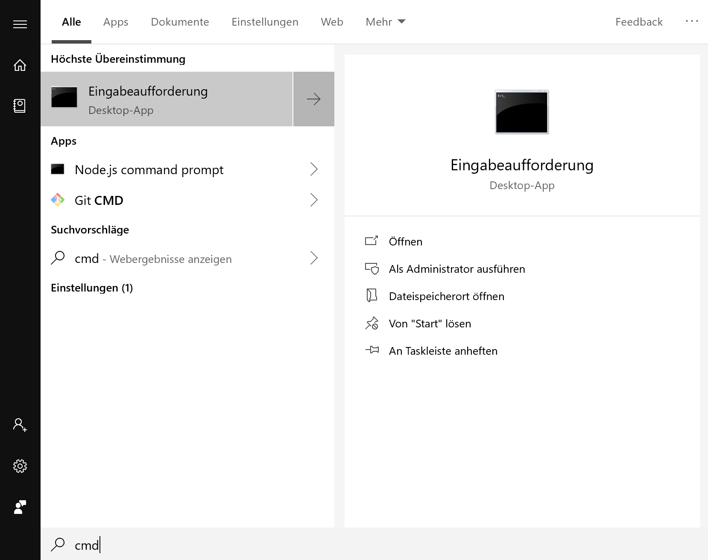
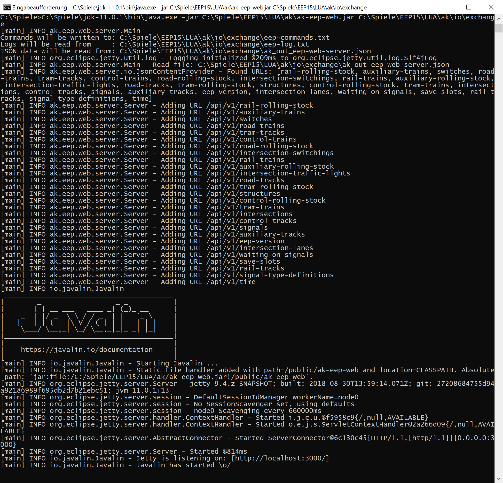
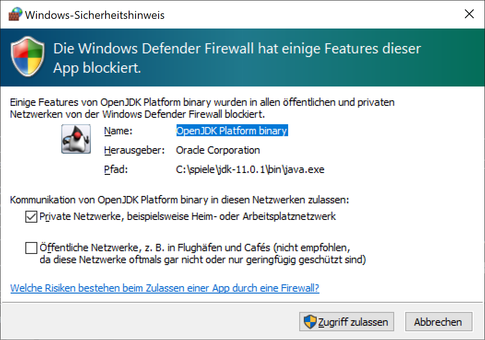
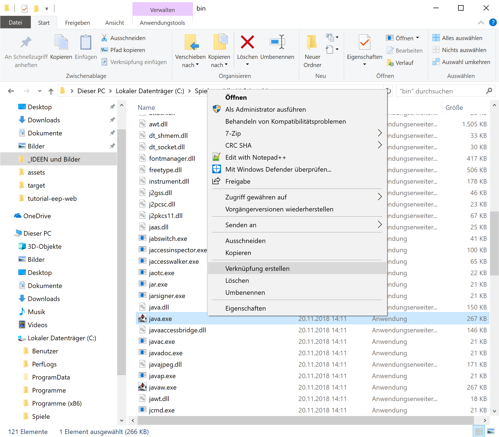
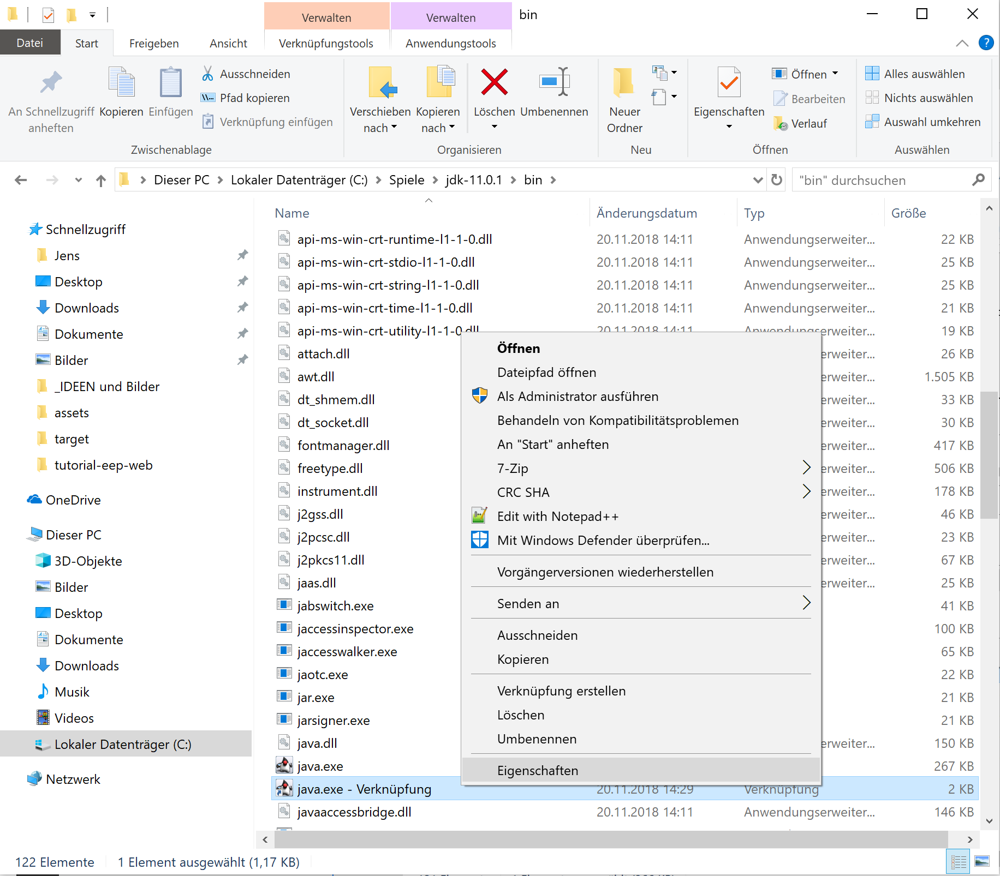
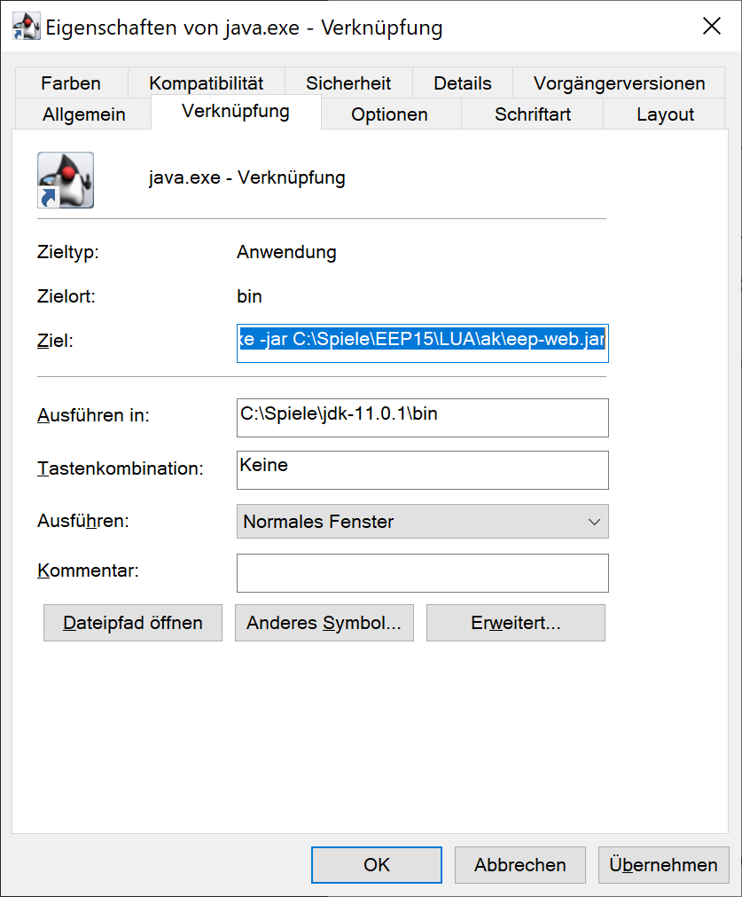

# Grundprinzip

* EEP schreibt Daten via Lua in das Verzeichnis ```LUA\ak\io\exchange```
* EEP-Web liest diese Daten und stellt sie auf einer Webseite bereit

# Vorbereitung in Lua

1. **Du brauchst für Lua**

   Eine aktuelle Version der Lua-Bibliothek von Andreas Kreuz - mindestens Version 0.5.0 ([siehe Installation](../anleitungen-anfaenger/installation))

2. **Lua einrichten**

   Wenn Du die Bibliothek installiert hast, dann nimm den Aufruf von `ModuleRegistry.runTasks()` in die vorhandene Funtion ```EEPMain()``` auf:

    ```lua
    local ModuleRegistry = require("ak.core.ModuleRegistry")
    ModuleRegistry.registerModules(
        require("ak.core.CoreLuaModule"),
        require("ak.strasse.KreuzungLuaModul")
    )

    function EEPMain()
        -- Dein bisheriger Code in EEPMain
        ModuleRegistry.runTasks()
        return 1
    end
    ```

3. **Einrichtung in Lua prüfen**

   Prüfe in der EEP-Installation, ob die Datei ```LUA\io\exchange\ak_out_eep-web-server.json``` geschrieben wird.

   _Hinweis_:Diese Datei wird angelegt wenn die Anlage im 3D-Modus läuft.


# Vorbereitungen

1. Lade Dir JAVA 11 herunter

    Quelle: https://jdk.java.net/11/ (Windows zip)

    

2. Entpacke JAVA 11 in das Verzeichnis ```C:\Trend``` (im Beispiel: ```C:\Spiele```)

     

     

# Starten von EEP-Web

1. Prüfe ob EEP-Web startet

    Starte Kommandozeile in Windows - Öffne das Startmenü mit der <kbd>Windows</kbd>-Taste und tippe `cmd`.

    

    Ziel: `C:\Spiele\jdk-11.0.1\bin\java.exe -jar C:\Spiele\EEP15\LUA\ak\ak-eep-web.jar C:\Spiele\EEP15\LUA\ak\io\exchange`

    Diese Zeile besteht aus 4 Teilen:

    1. Das Java-Programm: `C:\Spiele\jdk-11.0.1\bin\java.exe`
    2. Die Option `-jar`
    3. Der Pfad zu EEP-Web: `C:\Spiele\EEP15\LUA\ak\ak-eep-web.jar`
    4. Der Pfad zu zum Austausch mit EEP: `C:\Spiele\EEP15\LUA\ak\io\exchange`

    💡 Den Pfad musst Du entsprechend Deiner EEP-Version anpassen.
    z.B. Wenn Dein EEP nicht in C:\Spiele, sondern in C:\Trend liegt, oder wenn Du nicht EEP15 sondern eine frühere Version installiert hast.

    

    

    ⭐ Du hast es bis hierhin geschafft.
    Lege im nächsten Schritt eine Verknüpfung an, damit Du nicht die Kommandzeile verwenden musst.

2. Erstelle eine Verknüpfung um EEP-Web zu starten

    * Wähle im Ordner `C:\Spiele\jdk-11.0.1\bin` die Datei `java.exe` und erstelle mit der rechten Maustaste eine Verknüpfung.

      

    * Bearbeite die Eigenschaften der Verknüpfung

      

    * Schreibe die Kommandozeile von oben in das Feld "Ziel", also die komplette Zeile:
      `C:\Spiele\jdk-11.0.1\bin\java.exe -jar C:\Spiele\EEP15\LUA\ak\ak-eep-web.jar C:\Spiele\EEP15\LUA\ak\io\exchange`

      

    * Nun kannst Du die Verknüpfung auf den Desktop ziehen und umbenennen, z.B. in EEP-Web.


🍀 Du hast es bis hierhin geschafft, nun wünsche ich viel Spaß beim Benutzen von http://localhost:3000.

⭐ Wenn Du den Server von einem anderen PC erreichen möchtest, benutze statt `localhost` Deine IP-Address
z.B. `http://192.168.0.99:3000` oder Deinen Rechnernmamen, z.B. `http://deinrechnername:3000`. 