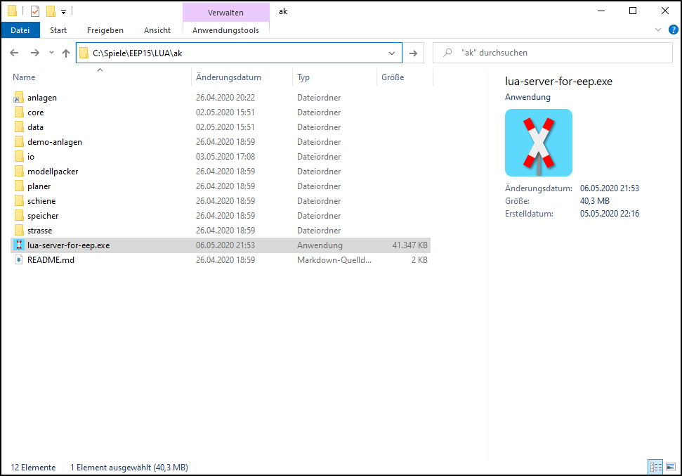
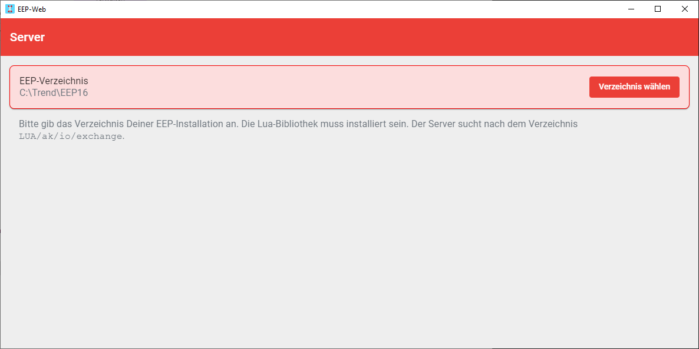

# Grundprinzip

- EEP schreibt Daten via Lua in das Verzeichnis `LUA\ak\io\exchange`
- EEP-Web liest diese Daten und stellt sie auf einer Webseite bereit

## Vorbereitung in Lua

1. **Du brauchst für Lua**

   Eine aktuelle Version der Lua-Bibliothek von Andreas Kreuz - mindestens Version 0.9.0 ([siehe Installation](../anleitungen-installation/installation))

2. **Lua einrichten**

   Wenn Du die Bibliothek installiert hast, dann nimm den Aufruf von `ModuleRegistry.runTasks()` in die vorhandene Funtion `EEPMain()` auf:

   ```lua
   local ModuleRegistry = require("ak.core.ModuleRegistry")
   ModuleRegistry.registerModules(
       require("ak.core.CoreLuaModule"),
       require("ak.road.CrossingLuaModul")
   )

   function EEPMain()
       -- Dein bisheriger Code in EEPMain
       ModuleRegistry.runTasks()
       return 1
   end
   ```

3. **Einrichtung in Lua prüfen**

   Prüfe in der EEP-Installation, ob die Datei `LUA\io\exchange\ak_out_eep-web-server.json` geschrieben wird.

   _Hinweis_: Diese Datei wird angelegt wenn die Anlage im 3D-Modus läuft.

## Starten von EEP-Web

1. Starte die exe aus `C:\Trend\EEP16\LUA\ak\lua-server-for-eep.exe`.

   

2. Falls der Lua-Server das Programm nicht findet, wähle das Verzeichnis Deiner EEP-Installation:

   

3. So sollte es aussehen, wenn der Server das Verzeichnis findet:

   

   🍀 Du hast es bis hierhin geschafft, nun wünsche ich viel Spaß beim Benutzen von `http://localhost:3000`.

   ⭐ Wenn Du den Server von einem anderen PC erreichen möchtest, benutze statt `localhost` Deine IP-Addresse
z.B. `http://192.168.0.99:3000` oder Deinen Rechnernmamen, z.B. `http://deinrechnername:3000`.
