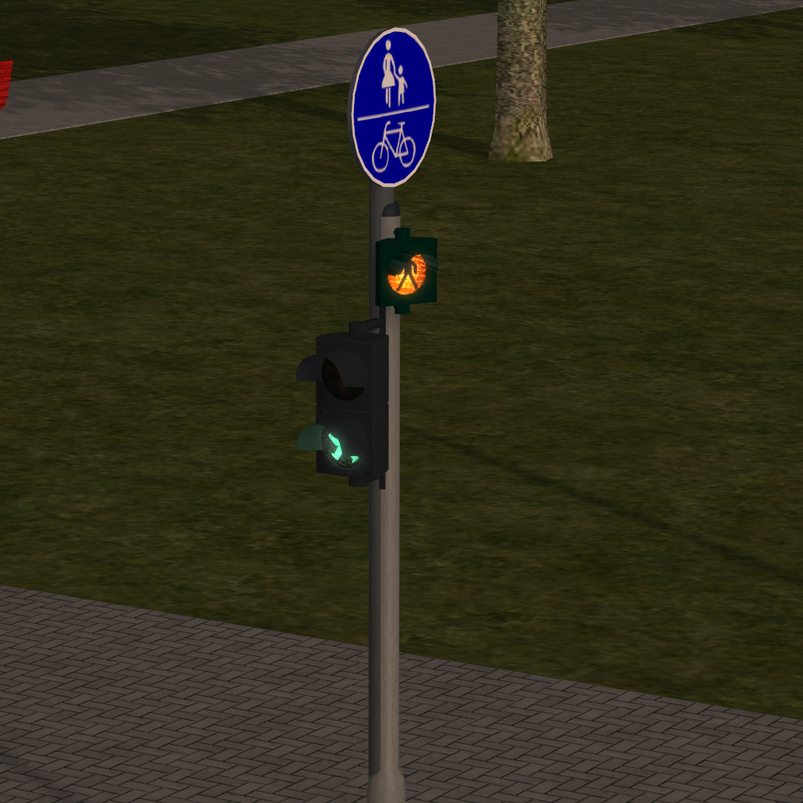

# Motivation

Willst Du mehr? - Lege Kontaktpunkte für die Verkehrszählung an, damit die Ampel mit dem meisten Andrang bevorzugt geschaltet wird.

Das bekommst Du:

- Automatisches Schalten von Ampeln an Kreuzungen
- Priorisiertes Schalten der Ampeln nach Verkehrsandrang
- Optional, Ampeln nur dann schalten, wenn jemand davor wartet

# Zur Verwendung vorgesehene Klassen und Funktionen

## Klasse `TrafficLightModel`

Beschreibt das Modell einer Ampel mit den Schaltungen für rot, grün, gelb und rot-gelb, sowie dem Fußgängersignal (falls vorhanden - dann hat die Ampel für den Straßenverkehr rot)

### `TrafficLightModel:new()` - Ampelmodell anlegen

| Aufruf                                                                                                                                                                        |
| ----------------------------------------------------------------------------------------------------------------------------------------------------------------------------- |
| `TrafficLightModel:new(name, signalIndexRed, signalIndexGreen, signalIndexYellow, signalIndexRedYellow, signalIndexPedestrian, signalIndexSwitchOff, signalIndexBlinkYellow)` |

Jedes `TrafficLightModel` beschreibt, welche Signalstellung in EEP verwendet werden muss, um eine Ampel rot, rot-gelb, grün oder gelb zu schalten. Auch kann hinterlegt werden, welche Signalstellung für Fußgänger grün und welche für Ampel aus oder blinkend genutzt werden soll.
Mit der Funktion legst Du neue Modelle an. Das machst Du für jedes 3D-Modell, dass Du in einer Ampel nutzen möchstest, falls das Modell
nicht schon mitgeliefert wird.

| Parameter                | Typ    | Bedeutung                                                                        |
| ------------------------ | ------ | -------------------------------------------------------------------------------- |
| name                     | string | Name des Ampeltyps                                                               |
| signalIndexRed           | number | Signalstellung im Signaldialog für rot (Index in der Liste "Stellung" im Dialog) |
| signalIndexGreen         | number | Signalstellung im Signaldialog für grün                                          |
| _signalIndexYellow_      | number | Signalstellung im Signaldialog für gelb (optional, sonst rot)                    |
| _signalIndexRedYellow_   | number | Signalstellung im Signaldialog für rot-gelben (optional, sonst rot)              |
| _signalIndexPedestrian_  | number | Signalstellung im Signaldialog für Fussgaenger-grün (optional, sonst rot)        |
| _signalIndexSwitchOff_   | number | Signalstellung im Signaldialog für Ampel aus (optional, sonst grün)              |
| _signalIndexBlinkYellow_ | number | Signalstellung im Signaldialog für Ampel blinkt gelb                             |

| Rückgabewert                                            |
| ------------------------------------------------------- |
| `TrafficLightModel` (neu erstellte Tabelle bzw. Objekt) |

**Beachte**: Die Funktion musst mit `:new()` statt `.new()` aufgerufen werden -
also mit einem Doppelpunkt und nicht mit einem Punkt.

### Mitgelieferte Ampelmodelle

```lua
-- Fuer die Strassenbahnsignale von MA1 - http://www.eep.euma.de/downloads/V80MA1F003.zip
-- 4er Signal, Stellung 2 als grün, z.B. Strab_Sig_09_LG auf gerade schalten
-- 4er Signal, Stellung 3 als grün, z.B. Strab_Sig_09_LG auf links schalten
-- 3er Signal, Stellung 3 als grün, z.B. Ak_Strab_Sig_05_gerade oder
--                                       Ak_Strab_Sig_05_gerade schalten
TrafficLightModel.MA1_STRAB_4er_2_gruen = TrafficLightModel:new("MA1_STRAB_4er_2_gruen", 1, 2, 4, 4)
TrafficLightModel.MA1_STRAB_4er_3_gruen = TrafficLightModel:new("MA1_STRAB_4er_3_gruen", 1, 3, 4, 4)
TrafficLightModel.MA1_STRAB_3er_2_gruen = TrafficLightModel:new("MA1_STRAB_3er_2_gruen", 1, 2, 3, 3)

-- Fuer die Ampeln von NP1 - http://eepshopping.de - Ampelset 1 und Ampelset 2
TrafficLightModel.NP1_3er_mit_FG = TrafficLightModel:new("Ampel_NP1_mit_FG", 2, 4, 5, 3, 1)
TrafficLightModel.NP1_3er_ohne_FG = TrafficLightModel:new("Ampel_NP1_ohne_FG", 1, 3, 4, 2)

-- Fuer die Ampeln von JS2 - http://eepshopping.de - Ampel-Baukasten (V80NJS20039)
-- Diese Signale sind teilweise mit und ohne Fussgaenger
TrafficLightModel.JS2_2er_nur_FG = TrafficLightModel:new("Ak_Ampel_2er_nur_FG", 1, 1, 1, 1, 2, 3, 3)
TrafficLightModel.JS2_3er_mit_FG = TrafficLightModel:new("Ampel_3er_XXX_mit_FG", 1, 3, 5, 2, 6, 7, 8)
TrafficLightModel.JS2_3er_ohne_FG = TrafficLightModel:new("Ampel_3er_XXX_ohne_FG", 1, 3, 5, 2, 1, 6, 7)
-- Zusatzampeln mit nur GELB und GRÜN
TrafficLightModel.JS2_2er_OFF_YELLOW_GREEN = TrafficLightModel:new("Ampel_2er_Aus_Gelb-Grün", 1, 3, 5, 1, 1, 2, 6)
```

## Klasse `TrafficLight`

Diese Klasse wird dazu verwendet eine Signal auf der Anlage (signalId) mit einem Modell zu verknüpfen. Eine so verknüpfte Ampel kann dann einer Fahrspur zugewiesen werden. Die Ampel gilt für eine bestimmte Richtung und damit gegebenenfall für eine oder mehrere Fahrspuren.

### `TrafficLight:new()` - Ampel anlegen

| Aufruf                                                                                                                 |
| ---------------------------------------------------------------------------------------------------------------------- |
| `TrafficLight:new(name, signalId, trafficLightModel, redStructure, greenStructure, yellowStructure, requestStructure)` |

Jedes `TrafficLight` verbindet ein bestimmtes Signal anhand der Signal-ID mit einem Ampelmodell. Für die einfache Unterscheidung kann ein Name vergeben werden. Mit dieser Funktion legst Du eine neue Ampel an. Das machst Du für alle Signale in EEP, die Du in der Kreuzung als Ampel verwenden möchtest.

| Parameter            | Typ                 | Bedeutung                                                                        |
| -------------------- | ------------------- | -------------------------------------------------------------------------------- |
| `name`               | `string`            | Name der Ampel, z.B. "K1", "K2", "F1", "S1", "B1", "L1"                          |
| `signalId`           | `number`            | Die Signal-ID im Modul oben                                                      |
| `trafficLightModel`  | `TrafficLightModel` | Das verknüpfte Modell. Die Ampel muss dieses Modell in 3D nutzen.                |
| _`redStructure`_     | `string`            | Immobilien-ID in EEP für rot deren Licht eingeschaltet wird (optional)           |
| _`greenStructure`_   | `string`            | Immobilien-ID in EEP für grün deren Licht eingeschaltet wird (optional)          |
| _`yellowStructure`_  | `string`            | Immobilien-ID in EEP für gelb deren Licht eingeschaltet wird (optional)          |
| _`requestStructure`_ | `string`            | Immobilien-ID in EEP für Anforderungen deren Licht eingeschaltet wird (optional) |

| Rückgabewert                                       |
| -------------------------------------------------- |
| `TrafficLight` (neu erstellte Tabelle bzw. Objekt) |

**Beachte**: Die Funktion musst mit `:new()` statt `.new()` aufgerufen werden -
also mit einem Doppelpunkt und nicht mit einem Punkt.

_Vorschlag für den selbst vergebenen Namen:_

- `K1`, `K2`, `K3`, ... für Kfz
- `F1`, `F2`, `F3`, ... für Fußgänger
- `S1`, `S2`, `S3`, ... für Tram
- `B1`, `B2`, `B3`, ... für Bus
- `L1`, `L2`, `L3`, ... für unsichtbare Fahrspur-Ampeln

### `TrafficLight:applyToLane()` - Ampel für Fahrspur nutzen

| Aufruf                                       |
| -------------------------------------------- |
| `TrafficLight:applyToLane(lane, [route...])` |

Fahrspuren werden standardmäßig nur durch ihre Fahrspur-Ampel geschaltet. Mit `TrafficLight:applyToLane(lane, [route...])`` kannst Du der Fahrspur eine andere Ampel als die Fahrspur-Ampel zuweisen. In diesem Fall sollte die Fahrspur-Ampel immer unsichtbar sein.

| Parameter | Typ      | Bedeutung                                                             |
| --------- | -------- | --------------------------------------------------------------------- |
| `name`    | `string` | Fahrspur, die durch diese Ampel geschaltet werden soll.               |
| `route`   | `string` | Optional: Diese Ampel soll nur für die angegebene(n) Route(n) gelten. |

| Rückgabewert                                       |
| -------------------------------------------------- |
| `TrafficLight` (neu erstellte Tabelle bzw. Objekt) |

**Beachte**: Die Funktion musst mit `:new()` statt `.new()` aufgerufen werden -
also mit einem Doppelpunkt und nicht mit einem Punkt.

### `TrafficLight:addLightStructure()` - Lichtsteuerung von Immobilien

| Aufruf                                                                                            |
| ------------------------------------------------------------------------------------------------- |
| `TrafficLight:addLightStructure(redStructure, greenStructure, yellowStructure, requestStructure)` |

Fügt bis zu vier Immobilien zu einer Ampel `TrafficLight` hinzu, deren Licht ein oder ausgeschaltet wird, sobald die Ampel auf rot, gelb oder grün geschaltet wird bzw. wenn sich die Anforderung an der Ampel ändert.

| Parameter            | Typ      | Bedeutung                                                                        |
| -------------------- | -------- | -------------------------------------------------------------------------------- |
| `redStructure`       | `string` | Immobilien-ID in EEP für rot deren Licht eingeschaltet wird                      |
| `greenStructure`     | `string` | Immobilien-ID in EEP für grün deren Licht eingeschaltet wird                     |
| _`yellowStructure`_  | `string` | Immobilien-ID in EEP für gelb deren Licht eingeschaltet wird (optional)          |
| _`requestStructure`_ | `string` | Immobilien-ID in EEP für Anforderungen deren Licht eingeschaltet wird (optional) |

| Rückgabewert                                                                                   |
| ---------------------------------------------------------------------------------------------- |
| TrafficLight (Tabelle bzw. Objekt) - Die Ampel, welcher die Lichtimmobilen hinzugefügt werden. |

**Beachte**: Die Funktion musst mit `:addLightStructure()` statt `.addLightStructure()` aufgerufen werden -
also mit einem Doppelpunkt und nicht mit einem Punkt.

_Hinweis:_
Passende Modelle für die Steuerung der Immobilien mit Licht findest Du im Modellset V10MA1F011.
Download unter <https://eep.euma.de/downloads.php> - Im Modell befindet sich eine ausführliche Doku.

### `TrafficLight:addAxisStructure()` - Achssteuerung von Immobilien



| Aufruf                                                                                                                                 |
| -------------------------------------------------------------------------------------------------------------------------------------- |
| `TrafficLight:addAxisStructure(structureName, axisName, positionDefault, positionRed, positionGreen, positionRed, positionPedestrian)` |

Fügt bis zu vier Immobilien zu einer Ampel `TrafficLight` hinzu, deren Licht ein oder ausgeschaltet wird, sobald die Ampel auf rot, gelb oder grün geschaltet wird bzw. wenn sich die Anforderung an der Ampel ändert.

| Parameter            | Typ                 | Bedeutung                                                                |
| -------------------- | ------------------- | ------------------------------------------------------------------------ |
| `structureName`      | `string`            | Name der Immobilie, deren Achse gesteuert werden soll                    |
| `axisName`           | `number`            | Name der Achse in der Immobilie, die gesteuert werden soll               |
| `positionDefault`    | `TrafficLightModel` | Grundstellung der Achse (wird für alle nicht angegebenen Phasen genutzt) |
| `positionRed`        | `string`            | Achsstellung bei rot                                                     |
| `positionGreen`      | `string`            | Achsstellung bei grün                                                    |
| `positionRed`        | `string`            | Achsstellung bei gelb                                                    |
| `positionPedestrian` | `string`            | Achsstellung bei FG                                                      |

| Rückgabewert                                                                                   |
| ---------------------------------------------------------------------------------------------- |
| TrafficLight (Tabelle bzw. Objekt) - Die Ampel, welcher die Achsenimmobilie hinzugefügt wurde. |

**Beachte**: Die Funktion musst mit `:addAxisStructure()` statt `.addAxisStructure()` aufgerufen werden -
also mit einem Doppelpunkt und nicht mit einem Punkt.

## Klasse `Lane`

Eine Fahrspur definiert sich dadurch, dass darin Autos in einer Schlange an einer Fahrspur-Ampel anstehen.
Die Fahrspur-Ampel ist zwingend notwendig und kann direkt oder indirekt in Schaltungen verwendet werden.

### `Lane.Directions` - Fahrrichtungen

Um die Fahrtrichtungen einer Fahrspur festzulegen, nutze einen der folgenden Werte:

- `Lane.Directions.LEFT`
- `Lane.Directions.HALF_LEFT`
- `Lane.Directions.STRAIGHT`
- `Lane.Directions.HALF_RIGHT`
- `Lane.Directions.RIGHT`

### `Lane:new()` - Neue Fahrspur anlegen

| Aufruf                                                             |
| ------------------------------------------------------------------ |
| `Lane:new(name, eepSaveId, trafficLight, directions, trafficType)` |

Jede Fahrspur `Lane` bekommt genau eine Ampel `TrafficLight` als Fahrspursignal. Diese Ampel bestimmt, ob das erste
Fahrzeug in der Fahrspur fahren darf

| Parameter      | Typ                        | Bedeutung                                                          |
| -------------- | -------------------------- | ------------------------------------------------------------------ |
| `name`         | `string`                   | Name der Fahrspur, z.B. "L1", "L2", ... oder "K1L1", "K1L2", ...   |
| `eepSaveId`    | `number`                   | Freie EEP-Speicher-ID (1 - 1000), für die Datenablage der Fahrspur |
| `trafficLight` | `TrafficLight`             | Die Fahrspur-Ampel muss angegeben werden.                          |
| `directions`   | `{ Lane.Directions, ... }` | Tabelle mit einer oder mehreren Richtungen (optional)              |
| `trafficType`  | `string`                   | Verkehrstyp (OBSOLET, MUSS IN `TrafficLight` übertragen werden)    |

| Rückgabewert                               |
| ------------------------------------------ |
| `Lane` (neu erstellte Tabelle bzw. Objekt) |

**Beachte**: Die Funktion musst mit `:new()` statt `.new()` aufgerufen werden -
also mit einem Doppelpunkt und nicht mit einem Punkt.

### `Lane:vehicleEntered()` / `lane:vehicleLeft(Zugname)` - Fahrzeuge mit Kontaktpunkten zählen

1. _Fahrspur betreten_<br> Rufe im Kontaktpunkt die Funktion `lane:vehicleEntered(Zugname)` auf, wenn ein Fahrzeug den Bereich betritt.

2. _Fahrspur verlassen_<br> Rufe im Kontaktpunkt die Funktion `lane:vehicleLeft(Zugname)` auf, wenn ein Fahrzeug den Bereich verlässt.

[Mehr Informationen zur Fahrzeugerkennung in der Dokumentation](../../../docs/anleitungen-ampelkreuzung/tutorial3-priorisierung).

### `Lane:useSignalForQueue()` - Fahrzeuge an der Fahrspur-Ampel erkennen (NICHT EMPFOHLEN)

Dies zählt die Fahrzeig an der Fahrzeugampel. Da die Funktion aber nur zwischen Vor- und Hauptsignal funktioniert, wird sie nicht empfohlen! [Mehr Informationen zur Fahrzeugerkennung in der Dokumentation](../../../docs/anleitungen-ampelkreuzung/tutorial3-priorisierung).

### `Lane:useTrackForQueue(roadId)` - Fahrzeuge an der Straße erkennen (NICHT EMPFOHLEN)

Um die Fahrspur zu priorisieren, wenn sich **ein beliebiges Fahrzeug** auf der Straße vor der Ampel befindet, muss die ID des Straßenstücks einmalig hinterlegt werden: `lane:useTrackForQueue(strassenId)`. Da die Funtion aber weder die Reihenfolge der Fahrzeuge erkennt noch mehrere Fahrzeuge pro Track, wird sie nicht empfohlen! [Mehr Informationen zur Fahrzeugerkennung in der Dokumentation](../../../docs/anleitungen-ampelkreuzung/tutorial3-priorisierung).

## Klasse `CrossingSequence`

Die Schaltung `CrossingSequence` ist verantwortlich für den Wechsel zwischen den roten und grünen Ampelphasen. Jede Schaltung bekommt dafür mindestens eine Ampel.
Es sollten mindestens zwei Schaltungen `CrossingSequence` in einer Kreuzung angelegt werden. Für das Anlegen neuer Schaltungen wird die Funktion `Crossing:newSequence(name)` empfohlen

Wird dazu verwendet, mehrere Fahrspuren gleichzeitig zu schalten. Es muss sichergestellt werden, dass sich die Fahrwege der Fahrspuren einer Schaltung nicht überlappen.

- `CrossingSequence:new(name)` - legt eine neue Schaltung an

- `CrossingSequence:addCarLights(K1)` fügt eine Ampel hinzu, für die mit den Zyklen Rot, Rot-Gelb, Gruen und Gelb geschaltet wird.

- `CrossingSequence:addTramLights(S1)` fügt eine Ampel hinzu, für die mit den Zyklen Rot, Gruen und Gelb geschaltet wird.

- `CrossingSequence:addPedestrianLights(F1)` fügt eine Ampel hinzu, für die mit den Zyklen Rot, Gruen_Fussgaenger geschaltet wird.

### `CrossingSequence:addCarLights()` - Ampeln für Kfz hinzufügen

| Aufruf                       |
| ---------------------------- |
| `Crossing:addCarLights(...)` |

Fügt eine oder mehrere Ampeln vom Typ `TrafficLight` als Kfz-Ampeln zur Kreuzung hinzu. Diese Schalten nacheinander "Rot", "Rot-Gelb", "Grün", "Gelb", "Rot"

| Parameter | Typ                 | Bedeutung                                                    |
| --------- | ------------------- | ------------------------------------------------------------ |
| `...`     | `TrafficLight`, ... | Eine oder mehrere Ampeln (kommasepariert, nicht als Tabelle) |

| Rückgabewert                                        |
| --------------------------------------------------- |
| `CrossingSequence`, der die Ampel hinzugefügt wurde |

**Beachte**: Die Funktion musst mit `:addCarLights()` statt `.addCarLights()` aufgerufen werden -
also mit einem Doppelpunkt und nicht mit einem Punkt.

### `CrossingSequence:addPedestrianLights()` - Ampeln für Fußgänger hinzufügen

| Aufruf                              |
| ----------------------------------- |
| `Crossing:addPedestrianLights(...)` |

Fügt eine oder mehrere Ampeln vom Typ `TrafficLight` als Kfz-Ampeln zur Kreuzung hinzu. Diese Schalten nacheinander "Rot", "Grün Fußgänger", "Rot"

| Parameter | Typ                 | Bedeutung                                                    |
| --------- | ------------------- | ------------------------------------------------------------ |
| `...`     | `TrafficLight`, ... | Eine oder mehrere Ampeln (kommasepariert, nicht als Tabelle) |

| Rückgabewert                                        |
| --------------------------------------------------- |
| `CrossingSequence`, der die Ampel hinzugefügt wurde |

**Beachte**: Die Funktion musst mit `:addPedestrianLights()` statt `.addPedestrianLights()` aufgerufen werden -
also mit einem Doppelpunkt und nicht mit einem Punkt.

### `CrossingSequence:addTramLights()` - Ampeln für Trams hinzufügen

| Aufruf                        |
| ----------------------------- |
| `Crossing:addTramLights(...)` |

Fügt eine oder mehrere Ampeln vom Typ `TrafficLight` als Tram-Ampeln zur Kreuzung hinzu. Diese Schalten nacheinander "Rot", "Grün", "Gelb", "Rot"

| Parameter | Typ                 | Bedeutung                                                    |
| --------- | ------------------- | ------------------------------------------------------------ |
| `...`     | `TrafficLight`, ... | Eine oder mehrere Ampeln (kommasepariert, nicht als Tabelle) |

| Rückgabewert                                        |
| --------------------------------------------------- |
| `CrossingSequence`, der die Ampel hinzugefügt wurde |

**Beachte**: Die Funktion musst mit `:addTramLights()` statt `.addTramLights()` aufgerufen werden -
also mit einem Doppelpunkt und nicht mit einem Punkt.

## Klasse `Crossing`

### `Crossing:new()` - neue Kreuzung anlegen

| Aufruf                                  |
| --------------------------------------- |
| `Crossing:new(name, greenPhaseSeconds)` |

Legt eine neue Kreuzung an und registriert diese im Modul Kreuzungen. Nachdem Schaltungen zur Kreuzung hinzugefügt wurden, funktioniert diese automatisch.

| Parameter             | Typ      | Bedeutung                                                             |
| --------------------- | -------- | --------------------------------------------------------------------- |
| `name`                | `string` | Name der Kreuzung, z.B. "Bahnshofsstr. / Hauptstr." oder "Kreuzung 1" |
| _`greenPhaseSeconds`_ | `number` | Länge einer Grünphase                                                 |

| Rückgabewert                                   |
| ---------------------------------------------- |
| `Crossing` (neu erstellte Tabelle bzw. Objekt) |

**Beachte**: Die Funktion musst mit `:new()` statt `.new()` aufgerufen werden -
also mit einem Doppelpunkt und nicht mit einem Punkt.

### `Crossing:addSequence()` - Eine Schaltung in einer Kreuzung erstellen

| Aufruf                       |
| ---------------------------- |
| `Crossing:addSequence(name)` |

Fügt eine oder mehrere Ampeln vom Typ `TrafficLight` als Tram-Ampeln zur Kreuzung hinzu. Diese Schalten nacheinander "Rot", "Grün", "Gelb", "Rot"

| Parameter | Typ      | Bedeutung                                        |
| --------- | -------- | ------------------------------------------------ |
| `name`    | `string` | Name der Schaltung, z.B. "S1" oder "Schaltung A" |

| Rückgabewert                                           |
| ------------------------------------------------------ |
| `CrossingSequence`, die der Kreuzung hinzugefügt wurde |

**Beachte**: Die Funktion musst mit `:addSequence()` statt `.addSequence()` aufgerufen werden -
also mit einem Doppelpunkt und nicht mit einem Punkt.

### `Crossing:addStaticCam()` - Eine Kamera zu dieser Kreuzung hinzufügen

| Aufruf                        |
| ----------------------------- |
| `Crossing:addStaticCam(name)` |

Fügt eine oder mehrere Ampeln vom Typ `TrafficLight` als Tram-Ampeln zur Kreuzung hinzu. Diese Schalten nacheinander "Rot", "Grün", "Gelb", "Rot"

| Parameter | Typ      | Bedeutung                         |
| --------- | -------- | --------------------------------- |
| `name`    | `string` | Name der statischen Kamera in EEP |

| Rückgabewert |
| ------------ |
| `nil`        |

**Beachte**: Die Funktion musst mit `:addStaticCam()` statt `.addStaticCam()` aufgerufen werden -
also mit einem Doppelpunkt und nicht mit einem Punkt.

# Wichtige Hinweise

- **Damit das Ganze funktioniert**, muss `EEPMain()` mindestens folgende Befehle verwenden:

  ````lua
  local ModuleRegistry = require("ak.core.ModuleRegistry")
  ModuleRegistry.registerModules(
      require("ak.core.CoreLuaModule"),
      require("ak.road.CrossingLuaModul") -- Registriert das Kreuzungsmodul
  )

  function EEPMain()
      ModuleRegistry.runTasks() -- Führt alle anstehenden Aktionen der registrierten Module aus
      return 1
  end```

  ````

- **Fahrspuren mit Anforderungen und Fahrspuren die durch unterschiedliche Ampeln gesteuert werden benötigen zwingend Zählfunktionen** für die Fahrzeuge dieser Fahrspur. Für andere Fahrspuren ist dies optional.

  - `lane:vehicleEntered(Zugname)` - im Kontaktpunkt aufrufen, wenn eine Fahrspur betreten wird (z.B. 50m vor der Ampel; aber nur auf dieser Fahrspursfahrbahn)

  - `lane:vehicleLeft(Zugname)` - im Kontaktpunkt aufrufen, wenn eine Fahrspur verlassen wird (hinter der Ampel)

  In der Zählfunktion MUSS der Zugname benutzt werden, da die Anforderungen und unterschiedlichen Ampeln durch die Routen der Fahrzeuge berechnet werden. Dazu dient folgender Quellcode:

  ```lua
  ------------------------------------------------
  -- Damit kommt wird die Variable "Zugname" automatisch durch EEP belegt
  -- http://emaps-eep.de/lua/code-schnipsel
  ------------------------------------------------
  setmetatable(_ENV, {
      __index = function(_, k)
          local p = load(k)
          if p then
              local f = function(z)
                  local s = Zugname
                  Zugname = z
                  p()
                  Zugname = s
              end
              _ENV[k] = f
              return f
          end
          return nil
      end
  })
  ```

  **Beachte:** Die Zählfunktionen müssen beim Betreten und Verlassen einer Fahrspur verwendet werden.
